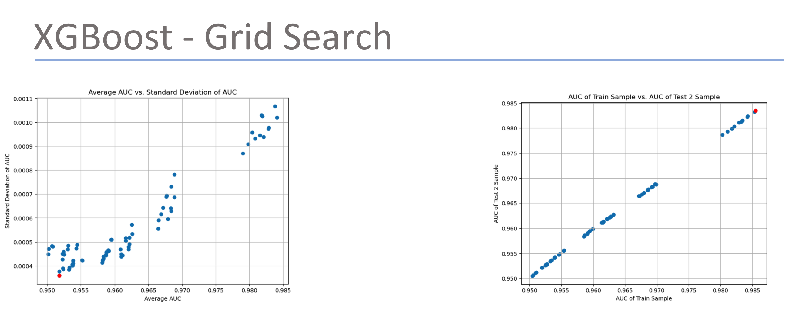
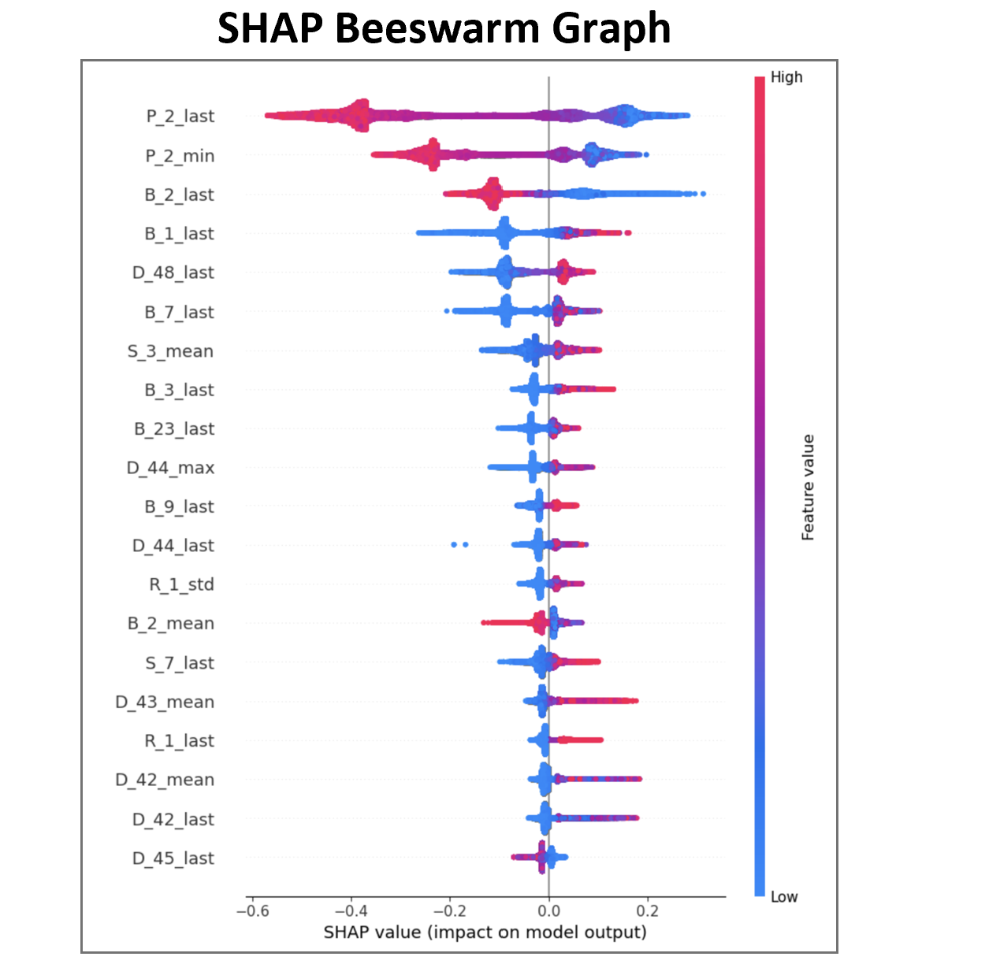
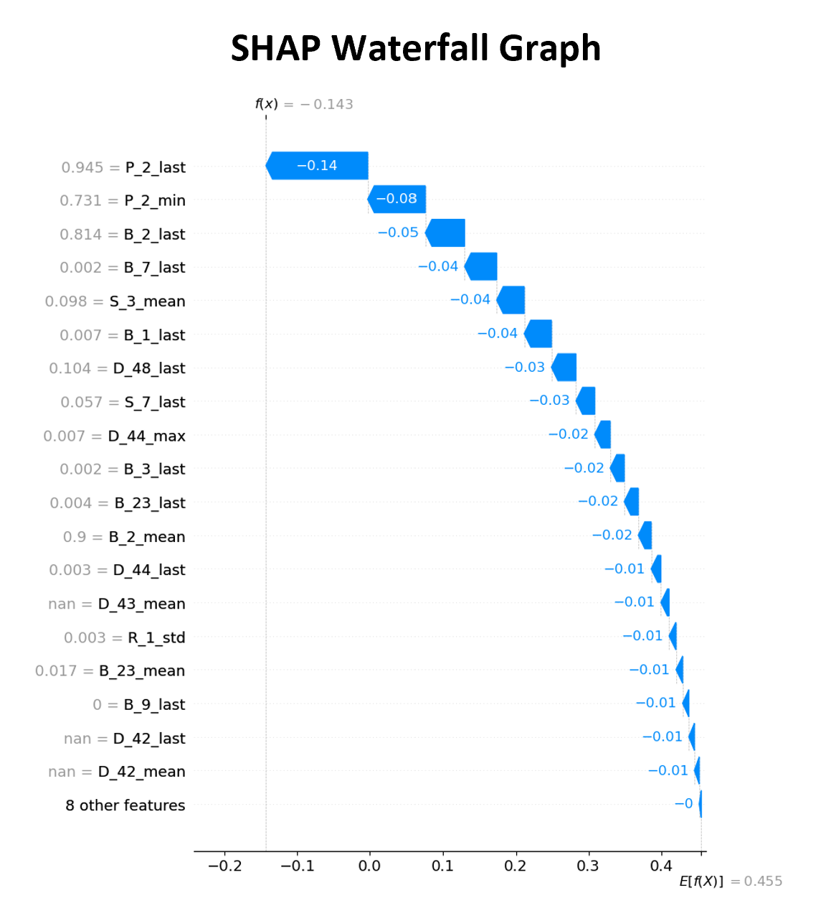
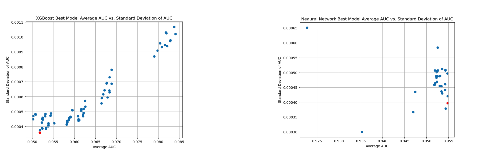

# Credit Risk Modeling using XGBoost & Neural Networks

## Objective
The current credit approval strategy results in a high default rate
(~24.65%), leading to increased company costs and reduced profitability.
This project aims to build predictive models to estimate the
Probability of Default (PD) and support data-driven credit decisions.

## Tools
Python, Pandas, NumPy, Scikit-learn, XGBoost, SHAP, TensorFlow/Keras

## Approach
- Performed data preprocessing and feature engineering
- Handled missing values and categorical variables using One-Hot Encoding
- Built XGBoost models with Grid Search for hyperparameter tuning
- Applied SHAP for explainability and feature contribution analysis
- Built Neural Network models with multiple architectures and grid search
- Compared model performance using AUC scores

## Feature Engineering
- Numeric features: mean, standard deviation, min, max, last value
- Categorical features: response rate in last 6 months,
  ever response in last 12 months
- Created aggregated features across customers

## Model Selection
- XGBoost: trained 36 models using grid search
- Neural Network: trained 32 model variations
- Final model selected based on highest AUC and consistency

## Key Insights
- Top features contributed nearly 25% to default probability
- Neural Network achieved slightly higher AUC than XGBoost
- SHAP analysis provided transparent interpretation of predictions
- Model-driven strategy reduced default rate to 5–10%

## Dataset
The original dataset is large and confidential.

A representative sample dataset is provided for demonstration and reproducibility.

location: data/sample_credit_data.csv

## Screenshots

## How to Run
Open the notebook using Jupyter Notebook or JupyterLab.
Ensure Python 3 is installed with the following libraries:
pandas
numpy
scikit-learn
matplotlib
seaborn
shap
xgboost

Run the cells in [Notebook](notebook/notebook.ipynb)

## 📄 Report
A detailed project report summarizing the business problem, data preparation, modeling approach, and key insights is available below:

- [Report](report/report.pdf)

## Conclusion

This project demonstrates the application of machine learning techniques for credit risk analysis with a strong focus on explainability and business relevance. The approach balances predictive performance with interpretability, making it suitable for real-world financial decision-making.
